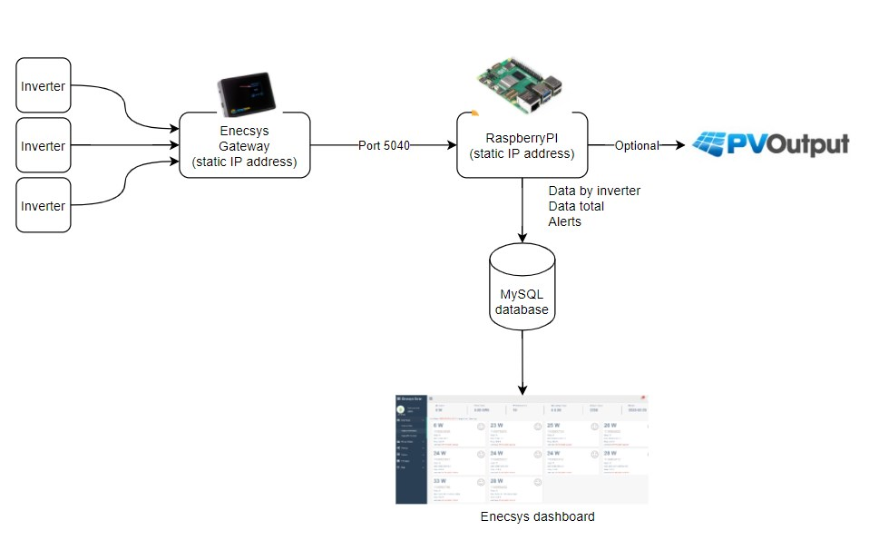

# Intro

Enecys went bankrupt in 2015 and a lot of users were left in the dark and lost monitoring of their PV data. This dashboard will give you all the info you need. 

If you have Enecsys Gen1 inverters, you are able to use this dashboard. It will give you an indication of your inverters, with long term history. Ad the same time it will
output the data to your pvoutput, which has a bit more detailed history overall. 

I have build-in long time history reports so the main tables will stay clean and users don't have to cleanup their data. 
The dashboard has been proven to run long time on RPI 2,3,4 and 5 since 2015.

The reason i choose for RPI as a platform and not a cloud setup, is so users don't have to rely on an online platform (again). You control your data. Also the costs are low.

## Flow diagram

## Important

- Only run the RPI in your local environment!
- I only support clean RPI installations. Any other setup is not supported. 

## Requirements hardware

## Hardware

Hardware costs are around 95 EUR.

- RPI 4 or 5(4gb)
- RPI case. Optional. 
- Power adapter
- Network cable
- Micro HDMI cable
- 8 GB (Scandisk) Micro SD Card. 
- SD Card reader: https://www.amazon.nl/dp/B081VHSB2V

Example: I have a live setup running since 2015 of which the database isn't larger then 10 MB. 

## Releasenotes

[Releasenotes](Releasenotes.md)

## Installation

[Installation](installation/INSTALL.md)
