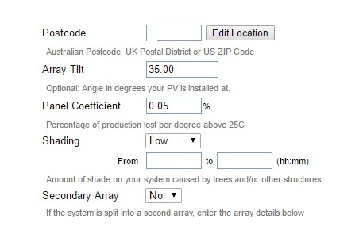

# contents

This version has been updated for php8.x support and RPI OS Bookworm.

## Software

- SD Formatter          | https://www.sdcard.org/downloads/formatter/
- Rufus                 | https://rufus.ie/en/
- Raspberry Pi Manager  | https://www.raspberrypi.com/software/
- Putty (SSH client)    | https://www.putty.org/ 

## PV Output

You can optional send your data to PVOutput. If you don't want that, just skip this step.

### Register account

In case you don't have an account, register one at https://pvoutput.org/register.jsp

After logging in press settings in the menu. Follow the screen and set the values according your Enecsys PV setup.


Skip the alert settings.

### Create API key

We need to create an APIkey, so the Enecsys dashboard can communicate with PV Output.


### Add system

Add a system and set the values according your setup
This system will contain your PV setup. Here you can see which information is visible for others on the team page: https://www.pvoutput.org/ladder.jsp?tid=1018 

| Item  | Value |
| ----  | ----- |
| System name   | This name will be visible in the overal Team overview |
| Status    | Active | 
| Number of panels | <set your number of panels>    |
| Panel max power   | The maximum power of one panel    |
| System size   | Total power of all panels together    |
| Panel brand/model | Optional  |
| Orientation   | Select your setup |
| Azimuth   | Set-your-value    |
| Number of inverters   | Set your total number of inverters    |
| Inverter size | Set same as system size   |
| Country   | Select your country   |
| Postal code | Optional    |
| Array tilt    | Set-your-value    |
| Panel coefficient | Set-your-value    |
| Shading   | select-your-value |

Example of a filled system page




#### Live settings

Set the status interval to 10 minutes. Do not change this interval to something else!


Everything else is optional and up to you.

### SystemId

Your system now has a systemId. We need this later in the Enecsys dashboard settings page.


Open the linkk https://www.pvoutput.org/ladder.jsp?tid=1018 and join the team by clicking the Join team button.

**Tip** In order to join the Tweakers team, a minimal of 20 inputs is required. 
You can run the dashboard, wait for the 20 inputs and then join the Team.

### UserId

The userId you can get when you open your personal output page. You will see the Id in the url in your browser. Copy this Id. We need it later when adding the settings in the Enecsys Dashboard. 


## RPI setup

In these steps i will guide you through the process of formatting the MicroSD cards and flash it with the latest OS (Operating System) for your Raspberry Pi.

### SD formatter

First thing is to format your MicroSD card. 

Open SD formatter, select your MicroSD card, select quick format, set a new name and click format. Wait until its done. Your SD card is now formatted.


### RPI manager

Start the RPI manager tool and follow these steps:

- select your RPI model
- Select OS > Raspberry PI OS (other) > Raspberry Pi OS Lite (64-bit)
- Choose storage > Select your SD card

In the next step make sure you select SSH. That way you can login via SSH into your RPI. And change the timezone to your liking. After that save settings, click yes and continue to burning the image to your SD card.

After this you can put your SD card into the RPI and boot it. You can then find your RPI in your network and login via SSH (Putty).


### Find your RPI

In order to find your RPI IP Address in your network you can use an app or other network scanner.
For example: Fing
IOS: https://itunes.apple.com/nl/app/fing-netwerk-scanner/id430921107?mt=8 
Android: https://play.google.com/store/apps/details?id=com.overlook.android.fing&hl=nl


### Login via SSH

Now open Putty and connect to your RPI. 

- Hostname: the RPI IP address
- Port: 22
- Connection type: SSH


Now login. You will get a warning. Just click 'Ok'.


Login with the default credentials
- Username: pi
- Password: raspberry

### Raspi config - Advanced options

After logging in via SSH we change some basic settings. 

run this command:

```
sudo raspi-config
```

Interacting with the screen? Arrow keys, TAB, spacebar and ENTER key.

- Select 6 Advanced options > Enter
- Select A1 expand Filesystem > Enter > Ok


We will reboot after all steps are complete.

### Raspi config - Password change

I would recommend to change the password, but that's entirely up to you. 

- Select 1 System options > Enter
- Select S3 Password > Enter


When asked for a new password, just type it on the commandline. You will NOT see your password. Hit enter to confirm 


### Raspi config - Others

If you want you can check all other settings. It is up to you to change them or leave them as is. For example timezone is always usefull to check. 

- Select 5 Localization options > Enter
- Select L2 Timezone

### Raspi config - Save and Reboot

Return back to the main menu and select Finish > Enter.
This will reboot the RPI with the new settings.


## Prepare Enecsys Installer

In order to install the Enecsys Dashboard and scripts we will download all the necessary installers.

IF you want to copy-paste text/commands.
Copy in windows with normal copy method(Ctrl+c / mouse rightclick > copy)
Pasting on commandline can be done with rightclick.

Login to the RPI via SSH (Putty) and run these commands:

```
sudo apt update && apt upgrade -y
```
This can take some time, but you will see a progressbar in the bottom. 

### Download installers

I have created several installers so you don't have to install and download packages. First we will download all files needed.

Run these commands:
```
cd ~
wget https://raw.githubusercontent.com/nlmaca/Enecsys_Dashboard/master/installers/installer.sh

```
Now run this file so all needed installer scripts are automatically downloaded to your system.

```
bash installer.sh
```

### Download check

After this check if all the files are present with list.

```
ls
```
- 1.sudo_static_ip.sh
- 2.sudo_install_webserver.sh
- 3.sudo_create_database.sh
- 4.sudo_addsudoers.sh
- 5.install_dashboard_cron.sh
- 6.sudo_clean_install.sh


## Start installation

We will run the scripts one by one. 

### Static IP 

This will get the current Network adapter and set the current IP address as the static one. In case of an RPI reboot of router reboot your RPI will keep its current IP address.

Run this command with sudo (admin privileges)

```
cd /home/pi

sudo bash 1.sudo_static_ip.sh
```

### Install webserver

This script will install all needed packages to run the dashboard. This includes apache, mariaDB, phpmyadmin and php8.

```
cd /home/pi

sudo bash 2.sudo_install_webserver.sh
```

When phpmyadmin is installed you will be asked to select apache or lighttpd. Select Apache2 with the spacebar > Tab > Enter


Next question select **NO** by pressing TAB > Enter


At the end the root password for MySQL will be displayed. Copy this to your passwordManager. In case you missed it you can still check it after the installation in the file /home/pi/db_setup_enecsys.log

```
cat /home/pi/db_setup_enecsys.log
```


### Create Enecsys Database

This script will create a new database for the Enecsys dashboard. It will also create a new user. 

Be aware to keep the MySQL root password at hand (from the previous step). 

```
cd /home/pi

sudo bash 3.sudo_create_database.sh
```

The credentials will be added to the log file. Copy those also outside your RPI in your password manager. 

```
cat /home/pi/db_setup_enecsys.log
```
Example:


### Update Sudo user file

In order to reboot the RPI from the dashboard we will add the apache user to the sudoers file. Run this command:

```
sudo bash 4.sudo_addsudoers.sh
```

### Install dashboard

In order to run this script you have to set the webdirectory. In case you don't know it just run the command as shown below.

This script will set all the cronjobs (task scheduler) on the system. These tasks are needed to process history in the night, check for inverter/gateway alerts. 

Second all webfiles will be deployed to the webdirectory, so we can run the web configuration in the next step.

Run this command **without** sudo!

```
cd /home/pi

bash 5.install_dashboard_cron.sh enecys_solar
```

When done, you will something like this. In this message the url is displayed where you can open the dashboard. Copy the url and open it in your browser.


## Web configuration

Follow the steps below and fill in information is needed. 

### Step 1

Not really important. I just played around with some copyright screen. Just select `i agree` and continue.


###  Step 2

This will check if the config file is writable. If you have followed all steps this should return ok. 


but if not.... run this command from Putty.

```
sudo chmod 777 /var/www/html/enecsys_solar/include/config.php
```

### Step 3

This is an important step. We have to set the database credentials. You should have them copied from previous steps or check them from Putty on the command line.

```
cat /home/pi/db_setup_enecsys.log
```
| Item  | Value |
| ----  | -----  |
| Database host | 127.0.0.1 |
| Database name | <>    |
| Database username | <>    |
| Database password | (NOT the root password)   |
| Directory | already set   |

So. as an example


### Step 4

Finalize the installation.
The default credendials are:

- Username: admin
- Password: dashboard

You can add or change the password later on from the settings page. 


### Step 5

Now go back to Putty and run this command as final step. It will cleanup the installation. 

```
cd /home/pi
sudo bash 6.sudo_clean_install.sh
```

We will now move to the Enecsys Dashboard to update the settings, add our inverters and PVoutput information. 

After this we will edit our Enecsys Gateway and point it to the RPI, so data will be send to the RPI. 

We will have to reboot the RPI maybe a couple of times for the changes to save and activate. 

## Enecsys Dashboard 

Login from your browser in the dashboard.

```
- Username: admin
- Password: dashboard
```

For details of the settings page you can check the Help page in the Menu.

### Settings - Inverters

Navigate to Settings > Inverters.

Add every inverter you have. Make sure they are set correct. A common mistake is tha a 1 is missing in the front. As far as i know all inverters consists of 9 characters. 

Some fields are optional.

| Item  | value | Required  |
| ----  | ---- | --- | 
| Inverter  | (example: 110064977)  | Yes |
| Inverter Type | select    | Yes    |
| Part no   | <>    | No    |
| Build date   | <>    | No    |
| Duo/Single    | <>    | yes    |
| Watt Panel 1      | No of Watts per panel | yes| 
| Watt Panel 2      | No of Watts per panel | yes| 
| Alias    | (example: Rooftop left) | No | 


Example


### Settings - General

Just make sure all settings are set. 

| Item                  | Value                                 | Note |  
| --------------------- | ------------------------------------- | ---- |
| Gateway IP*           | set ip address of enecsys gateway     | ---- |
| Language              | English or Dutch                      | ---- |
| City                  | optional                              | ---- |
| Country               | optional                              | ---- |
| Timezone              | select yours                          | ---- |
| Currency              | select yours                          | ---- |
| kWh price             | set your price                        | ---- |
| Temperature           | celcius/farenheit                     | ---- |
| PV Output ID          | see [UserId](#userid)                 | ---- |
| PV Output SystemID    | see [SystemID](#systemid)             | ---- |
| PV Output TeamID      | 1018                                  | ---- |
| PV Output Team Name   | Enecsys by Tweakers                   | ---- |

Save the page when done.

```
Gateway IP*: Every 30 minutes the dashboard will ping the Enecsys gateway. If offline, a message will be visible in the top right screen.
```


### Settings - E2PV

Set the total amount of inverters, your PV Output API key and your SystemId (again).

| Item                              | Value | Note |  
| --------------------------------  | ----- | ---- |
| Verbose                           | 0 | Used for debugging. not editable  |
| Total inverters                   | set total no of inverters | |
| PV output apikey                  | Set your key | |
| PV output SystemID                | Set it again | |
| Lifetime                          | 0             | LIFETIME should be set to 0 if your lifetime kWh values produce wrong values. That seems to happen in some installations when panels are producing close to their maximum capacity. Especially duo-inverters seem to have this problem |
| Mode                              | | not editable |
| Extended                          | 0 | not editable |
| AC                                | 0 | In some cases, the reported data is e few percent too high. In those cases, define AC to 1 | 

See also help page for more info.

In case you have a neighbor that also has Enecsys inverters you can exclude them. Then add the ignore inverters. 


## Reboot

After you have done all this it is time to reboot the RPI. A reboot is **ALWAYS** required after any of the Settings are changed. Be aware if things aren't working properly to first reboot the RPI. 

System > Reboot > Reboot RPI


You can reboot the RPI from the commandline or via the dashboard.

```
sudo reboot
```

## Enecsys Gateway

Open your browser and point to the address of your Enecsys Gateway. If you don't know the IP Address you can find it on the display of the Gateway.


```
- Username: admin
- Password: password
```

I would advise to disable DHCP and set the current ipaddress as the new static one with your current settings.
If you don't have the knowledge about it, you can leave DHCP enabled on the gateway. 

Change the remote server to the ip address of the RPI. The port is 5040.

Click on apply settings. The gateway will reboot to apply the settings.


## Test your setup

In order to check if everything works you need... daylight and production from your inverters. 

Make sure you have: 

- configured the RPI
- Rebooted the RPI
- Pointed your Enecsys Gateway to the IP Address of the RPI. 

### Dashboard

The easiest is to check if inverter data is present. 

- 1. Last pulse to PV Output
- 2. Last time data received from the Gateway. This can differ per inverter. 
- 3. Alerts in case Gateway or inverter issues.
- 4. Last status of Inverter (see help page for inverter status codes)


#### Gateway alert

In case of (4) > Reboot the Enecsys Gateway.

In all other cases. Check [Gateway online status](#enecsys-gateway-status)

Worst case: 

- Reboot the RPI. Wait until you can access the dashboard.
- Then reboot the Enecsys gateway. Wait for the smiley face on the Gateway display.

Sometimes you have to reboot the Enecsys gateway several times.

### Enecsys Gateway status

In the gateway there is a debug page where you can check if the connection with the RPI is working. 

- 1. Messages are appearing (when there is production)
- 2. Messages are appearing (when there is production)
- 3. Online: connection with RPI is working. (Should also be online when there is no production.)
- 3. Offline: there is no connection between the Gateway and RPI. The gateway will not be able to send data to the RPI. 

How to fix offline statu: Reboot the RPI.


## Questions

in case of any questions feel free to open an issue on the github page.
https://github.com/nlmaca/Enecsys_Dashboard/issues